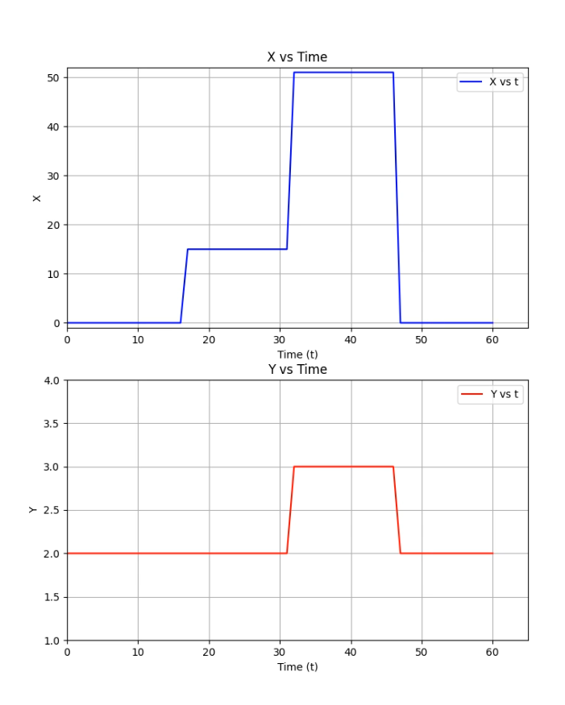

# GFS-DynRep: Google File System with Dynamic Replication

## Introduction

This project presents a simplified yet powerful implementation of the Google File System (GFS) in Python. It demonstrates key concepts of distributed file systems such as chunk-based storage, replication for fault tolerance, and a centralized master-server architecture.

A major enhancement over traditional GFS is the introduction of **Dynamic Replication**, which allows the system to automatically adjust the number of chunk replicas based on access patterns. This enables better load balancing and resource optimization compared to the static replication approach described in the original GFS design.

The system serves as an educational prototype for understanding scalable and resilient file storage systems that adapt to real-world workloads.

---

## Core Features & Functionalities

### Chunk-Based File Storage

Files are split into fixed-size chunks, each uniquely identified. This allows efficient storage, parallel access, and seamless replication.

### Master-Chunkserver Architecture

* **Master Server** manages all metadata, including file-to-chunk and chunk-to-server mappings.
* **Chunk Servers** store actual data and handle client requests for read/write operations.

### Fault Tolerance Through Replication

Chunks are replicated across multiple servers to ensure high availability. If one server fails, replicas on other servers maintain access to the data.

### Heartbeat Mechanism

Chunkservers periodically send heartbeat messages to the master to indicate liveness. This enables the master to detect failures and manage replicas accordingly.

### Dynamic Replication (Key Enhancement)

Traditional GFS uses a fixed replication factor, which can cause load imbalance or unnecessary resource usage. This project introduces **dynamic replication** based on chunk popularity:

* Chunk access rates are monitored over periodic intervals.
* **Replication is increased** for frequently accessed chunks to distribute load.
* **Replication is reduced** for infrequently accessed chunks to save storage.
* New replicas are assigned to the **least loaded** chunkservers.

This mechanism maintains the minimum required number of replicas for fault tolerance while ensuring efficient resource utilization.

---

## Dynamic Replication: Adaptive Semantics for Load Distribution

In large-scale systems, workloads often exhibit skewed access patterns, where certain files or chunks receive disproportionate traffic. Static replication fails to adapt to these variations.

This implementation improves on that by:

* Tracking **access frequency** of each chunk at regular intervals (e.g., every 15 seconds).
* Setting **upper and lower thresholds** to trigger replication increase or decrease.
* Placing new replicas on chunkservers with **lowest relative load**.
* Removing replicas from overloaded servers when redundancy is no longer necessary.

This ensures chunks that are in high demand are available on multiple servers, preventing hotspots, while reducing storage overhead for rarely accessed data.

 
Illustration: Chunk Access vs. Replication Adjustment

  

In the above plot:

Top graph (X vs Time) shows how access count for a chunk changes over time.

Bottom graph (Y vs Time) shows the corresponding number of replicas adjusted dynamically in response.

---

## Architecture Overview

The system is composed of three components:

### Master Server (`master_server.py`)

Acts as the control plane:

* Manages all metadata: file-to-chunk mappings, chunk locations, lease tracking.
* Orchestrates chunk placement and dynamic replication.
* Monitors server health via heartbeats.

### Chunk Server (`chunk_server.py`)

Stores and manages actual chunk data:

* Responds to client read/write requests.
* Periodically sends status and load reports to the master.
* Stores chunks in local directories.

### Client (`client.py`)

Provides the user interface to interact with the file system:

* Communicates with the master for metadata.
* Connects to chunkservers for actual data operations.
* Supports operations like upload, read, and update.

---

## Implementation Highlights

* **Python-based design**: Simplifies prototyping and focuses on concept clarity.
* **Flask-based communication**: RESTful APIs enable clean, modular interaction between components.
* **Periodic monitoring**: Access frequency and server load are periodically analyzed to drive replication decisions.
* **Load balancing**: Chunk placement logic avoids overloading specific servers by actively monitoring resource utilization.
* **Metadata and logs**: System state is maintained using lightweight in-memory structures and log files.

---

## Distributed Systems Principles Demonstrated

* **Centralized Metadata Management**: Simplifies coordination at the cost of potential bottlenecks (as in real GFS).
* **Chunk-based Fault Tolerance**: By replicating data across nodes, the system ensures resilience to server failures.
* **Heartbeat for Liveness**: Master detects chunkserver crashes via periodic heartbeats and updates metadata accordingly.
* **Dynamic Adaptation**: System self-adjusts to changing load patterns, balancing performance and resource usage.
* **Load-aware Scheduling**: Incorporates basic real-time monitoring to make informed decisions about replica placement.
* **Tradeoff Between Availability and Efficiency**: The system maintains a minimum number of replicas while optimizing for space and speed.

---

## Limitations

* **Interval-Based Adjustment**: Replica decisions are made at periodic intervals, which may lag behind sudden load changes.
* **Minimum Replica Constraint**: A lower bound on replication (e.g., two copies) ensures availability but limits flexibility.
* **Dependency on Metrics**: Accurate replication relies on representative access and load data. Inaccurate tracking can lead to suboptimal decisions.

---

## Future Work

This prototype lays the groundwork for a more advanced distributed file system. Future enhancements may include:

1. **Finer-Grained Monitoring**: More frequent or event-driven tracking to respond faster to access spikes.
2. **Predictive Replication**: Integrate machine learning models to forecast access trends and proactively adjust replication.
3. **Improved Fault Recovery**: Automate re-replication of lost chunks when servers fail or go offline.
4. **Security Integration**: Add authentication and access control to protect data integrity.
5. **Live Rebalancing**: Continuously redistribute chunks to maintain load symmetry without downtime.
6. **Snapshot Support**: Enable versioning and point-in-time recovery via snapshots or checkpoints.

---